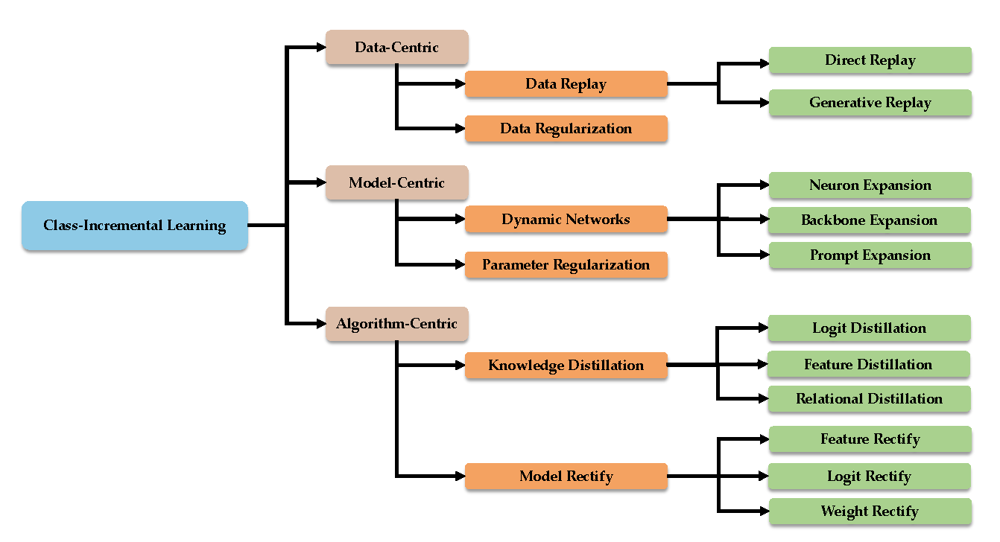

# COIL Code reproduction

Partially cited from: 

    @article{zhou2023class,
        author = {Zhou, Da-Wei and Wang, Qi-Wei and Qi, Zhi-Hong and Ye, Han-Jia and Zhan, De-Chuan and Liu, Ziwei},
        title = {Deep Class-Incremental Learning: A Survey},
        journal = {arXiv preprint arXiv:2302.03648},
        year = {2023}
     }


## Introduction

Deep models, e.g., CNNs and Vision Transformers, have achieved impressive achievements in many vision tasks in the closed world. However, novel classes emerge from time to time in our ever-changing world, requiring a learning system to acquire new knowledge continually. For example, a robot needs to understand new instructions, and an opinion monitoring system should analyze emerging topics every day. Class-Incremental Learning (CIL) enables the learner to incorporate the knowledge of new classes incrementally and build a universal classifier among all seen classes. Correspondingly, when directly training the model with new class instances, a fatal problem occurs --- the model tends to catastrophically forget the characteristics of former ones, and its performance drastically degrades. There have been numerous efforts to tackle catastrophic forgetting in the machine learning community. 
In this paper, we survey comprehensively recent advances in deep class-incremental learning and summarize these methods from three aspects, i.e., data-centric, model-centric, and algorithm-centric. We also provide a rigorous and unified evaluation of 16 methods in benchmark image classification tasks to find out the characteristics of different algorithms empirically. Furthermore, we notice that the current comparison protocol ignores the influence of memory budget in model storage, which may result in unfair comparison and biased results. Hence, we advocate fair comparison by aligning the memory budget in evaluation, as well as several memory-agnostic performance measures. 

<div align="center">
  


</div>

## Requirements

### Environment

Here are the requirements for running the code:

1. [torch 1.81](https://github.com/pytorch/pytorch)
2. [torchvision 0.6.0](https://github.com/pytorch/vision)
3. [tqdm](https://github.com/tqdm/tqdm)
4. [numpy](https://github.com/numpy/numpy)
5. [scipy](https://github.com/scipy/scipy)
6. [quadprog](https://github.com/quadprog/quadprog)
7. [POT](https://github.com/PythonOT/POT)

### Dataset

We use [CIFAR100](https://www.cs.toronto.edu/~kriz/cifar.html) for our experiments. CIFAR100 will be automatically downloaded when running the code. 


### Pre-Trained Models

As discussed in the main paper, we aim for a fair comparison among different methods and align the performance at the first stage. Please refer to the instructions to download the pre-trained models in the following section.

## Code Structures

- `checkpoints`: We supply the *same pre-trained checkpoints for most methods* for a fair comparison. Please download the checkpoint from [Google Drive](https://drive.google.com/drive/folders/1FLgnMkNuQyRLjYJ5Khnj370LtfYExZhm?usp=sharing) or [Onedrive](https://entuedu-my.sharepoint.com/:f:/g/personal/n2207876b_e_ntu_edu_sg/EhXYBtaQRbtKhFRaCJ6IgfEBykAUKDDynkfXMULBqYMnKA?e=rjz1sd) and put these checkpoints in this folder.
- `convs`: The network structures adopted in the implementation.
- `exps`: The **default** config files for compared methods. It should be noted that these config files will be overwritten by the parameters (e.g., function `setup_parser` in `main.py`) passed via the command line.
- `scripts`: The scripts for running the code in our evaluations.
- `models`: The implementation of different CIL methods.
- `utils`: Useful functions for dataloader and incremental actions.

## Supported Methods

- `Coil`: Co-Transport for Class-Incremental Learning. ACM MM2021 [[paper](https://arxiv.org/abs/2107.12654)]

# Summary of Work

Research Focus:

We focused on the problem of class-incremental learning in machine learning, which aims to update models with new data without retraining them entirely.
Implementation of COIL:

We replicated the "Co-Transport for Class-Incremental Learning" (COIL) method proposed in a specific research paper.
The COIL method addresses the challenge of catastrophic forgetting by leveraging semantic relationships between classes and utilizing forward and backward transport mechanisms for knowledge transfer across incremental tasks.
Experimental Setup:

We conducted experiments on the CIFAR-100 dataset, dividing it into multiple tasks, each containing a subset of classes.
A 32-layer ResNet model was used for these experiments, with specific training parameters and hardware setups.
Key Methodological Steps:

Prospective Transport: Initializing new class classifiers using the old class classifiers' semantic relationships via optimal transport algorithms.
Retrospective Transport: Preventing knowledge forgetting by transferring new class classifiers back to old classes during training.
Results and Analysis:

We verified the effectiveness of the COIL method on the CIFAR-100 dataset.
Our experiments showed that while COIL performed well, the results did not fully match the original paper's performance, highlighting areas for potential improvement.
We analyzed various performance metrics, including BWT (Backward Transfer) and memory conditions, providing insights into the model's behavior under different settings.
Challenges and Solutions:

We encountered issues such as parameter sensitivity, memory limitations, and computational complexity.
Solutions included parameter tuning, memory optimization techniques, and algorithmic improvements for efficient computation.
Future Directions:

We suggested potential improvements for COIL, such as optimizing the transport algorithm, reducing the dependency on stored data, and combining COIL with other forgetting mitigation techniques.

## Running scripts

There are three types of experiments in our survey, i.e., benchmark, memory-aligned (`fair`), and memory-agnostic (`auc`) in the `scripts` folder). We give all the scripts for running the experiments in this paper. For example, if you are interested in the benchmark comparison, please run the following command:

```bash
bash ./scripts/benchmark/cifar_b0_5_coil.sh
```

Similarly, you can run the other scripts in the same way. 

## Calculating the number of exemplars

It must be noted that the **memory-aligned** and **memory-agnostic comparison** protocol requires calculating the number of exemplars for each method. Please refer to `compute_exemplar.py` for more details. The following is an example of calculating the number of exemplars for the `fair` and `auc` protocol.

### Fair

```bash
bash run-fair.sh
```

### AUC

```bash
python compute_exemplar.py -p auc
```

## Acknowledgment

This repo is modified from [PyCIL](https://github.com/G-U-N/PyCIL).

